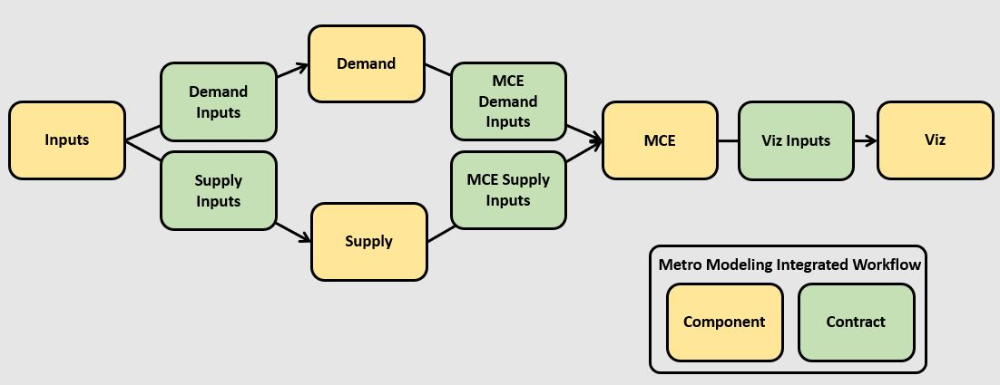

# Metro Modeling Integrated Workflow

Specifications for the Full Integrated Modeling Workflow From Start to Finish

## Overview 

Components in the Data Pipeline
  - Inputs - a set of inputs stored offline to run the full data pipeline from start to finish
  - [Demand](https://github.com/MetroModelingServices/tdm) - R-based demand model
  - Supply - EMME-based supply/network model - **coming soon**
  - [MCE](https://github.com/MetroModelingServices/metro_mce) - Python-based multi-criterion evaluation toolkit
  - [Visualizer](https://github.com/MetroModelingServices/mceviz) - Web-based MCE visualizer
  
Data Contracts between Components
  - [Demand Inputs](demand_inputs.md)
  - [Supply Inputs](supply_inputs.md)
  - [MCE Demand Inputs](mce_demand_inputs.md)
  - [MCE Supply Inputs](mce_supply_inputs.md)
  - [Visualizer Inputs](viz_inputs.md)
